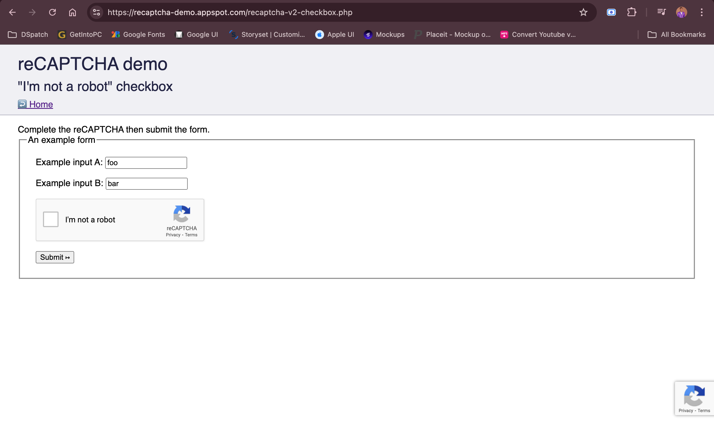
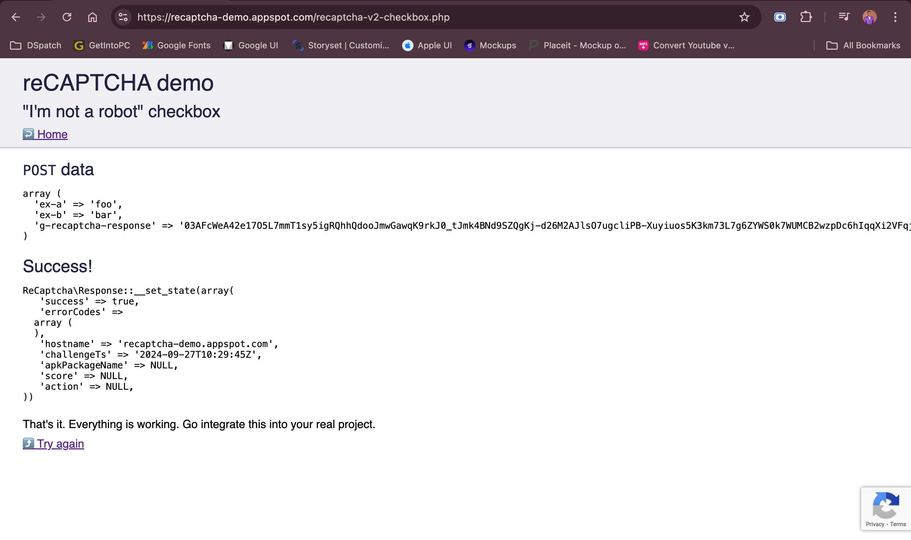

# Handling CAPTCHAs in Automation using 2captcha

This project demonstrates how to automate solving CAPTCHAs using the 2captcha service in Selenium-based browser automation. The script solves CAPTCHAs automatically by integrating 2captcha API with a Selenium-driven browser.

[reCAPTCHA demo page](https://recaptcha-demo.appspot.com/recaptcha-v2-checkbox.php)



[](https://youtu.be/10X5B2aSK9Y?si=Slc58HEc37Np2eSq)

## Features

- Automates CAPTCHA solving using 2captcha
- Uses Selenium to interact with web elements
- Follows the Page Object Model (POM) for better structure
- Automatically inputs data into fields, solves CAPTCHAs, and submits forms
- Demonstrates error handling for CAPTCHA service issues (e.g., insufficient balance)

## Prerequisites

Before you begin, ensure you have the following installed on your system:

- Python 3.x
- Selenium
- `pytest` (for running test cases)
- A 2captcha account with an API key (available at [2captcha](https://2captcha.com))

## Setup

1. Clone this repository:
   ```bash
   git clone https://github.com/Only1JohnN/handling-captchas-in-automation-using_2captcha
   ```

2. Install the required Python packages:
   ```bash
   pip install -r requirements.txt
   ```

3. Update the following values in the script:
   - `API_KEY`: Your 2captcha API key.
   - `SITE_KEY`: The site key for the CAPTCHA you want to solve.
   - `PAGE_URL`: The URL of the page containing the CAPTCHA.

4. Replace the example data (like input fields) with your target webpage’s data (if needed).

## Running the Script

You can execute the script using `pytest` as shown below:

```bash
pytest
```

Make sure to have your API key and sufficient funds in your 2captcha account.


## Handling Errors

- **ERROR_ZERO_BALANCE**: Make sure to top up your 2captcha account if you encounter this error.
- **Invalid API Key**: Double-check your 2captcha API key and ensure it’s entered correctly.